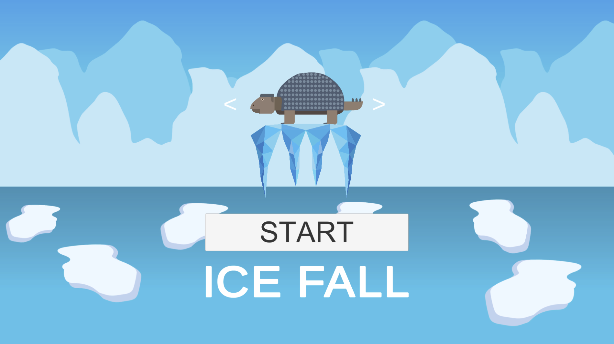
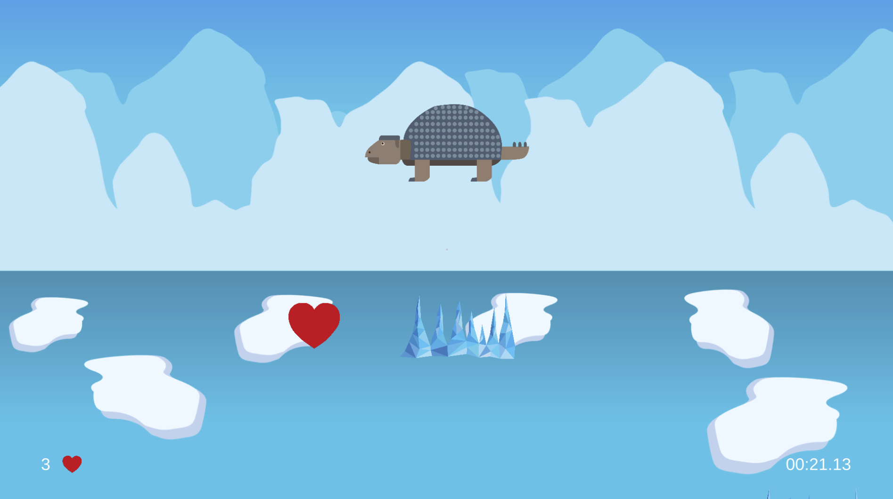
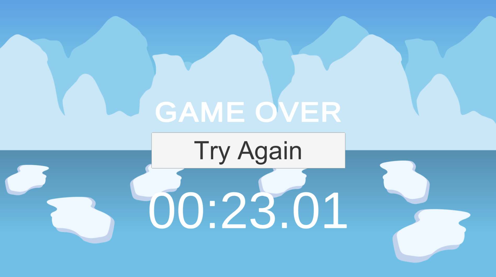

# IceFall-sglavan
This 2D game is about Carlos the ice armadillo who trys to survive in the dangerous Ice Age. 
Try to collect hearts and elude the dangerous ice from below. You have to survive as long as possible. 

 + Progress: Game is finished and playable.

 + Status: 100%

 + Trailer: https://youtu.be/6ZRGHjzqL-Q

 + PLAY THE GAME HERE: https://www.sharemygame.com/share/9b93aaf5-234f-47a4-839e-a64b4af143b3 /ACHTUNG BEI DIESER VERSION HAT DIE AUFLÖSUNG BEIM EXPORT NICHT FUNKTIONIET UND ICH WEISS LEIDER NICHT WARUM
(upload: 17.03.19 // 30 days online)

 + Development Platform: MacOS Mojave, Unity 2018.2.14, VS 7.7.2, Scripting Runtime Version: .NET 3.5
   Equivalent, API Compatibility Level: .NET 2.0 Subset

 + Target Platform: WebGL (Resolution: 1920*1080)

 + Controles: arrow key left, arrow key right, mouse click (in menu)

 + Resources: 
	- Font: LiberationSans SDF (TMP_FontAssets)
	- All imagery by Sarah Glavan, feel free to use
	- TextMeshPro (TMP) is needed when opening the Unity Project!

 + Third party material:
 	- https://unity3d.com/de/learn/tutorials/projects/2d-ufo-tutorial/controlling-player
 	- https://www.youtube.com/watch?v=AI8XNNRpTTw
	- Timer Script by our class

 + Concept:

 + In game Screenshots:

 + Limitations:
   This Game is very simple. There is no stimulation for the user to play the game longer than a few minutes. 
   Also is the background not moving upwards, so there is no illusion of Carlos falling down.

 + Lessons Learned:
   - How reuse an existing game setup for a new game in unity
   - Timer
   - Usage of Scriptable Objects

+ Testcase 1:
- Press "Start"
- Try to survive for 15 sec
- Kill the character
- Press "Try Again"

Copyright by Sarah Glavan, 2019

